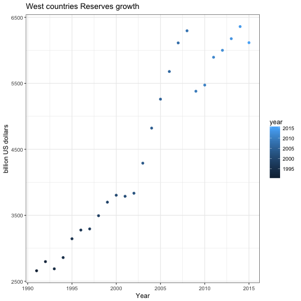

##Synopsis
Gross fixed capital formation (GFCF) is defined as the acquisition (including purchases of new or second-hand assets) and creation of assets by producers for their own use, minus disposals of produced fixed assets. The relevant assets relate to products that are intended for use in the production of other goods and services for a period of more than a year. The term "produced assets" means that only those assets that come into existence as a result of a production process recognised in the national accounts are included. Data are under 2008 System of National Accounts (SNA 2008) for all countries except for Chile, Japan and Turkey (SNA 1993). This indicator is in million USD at current prices and PPPs, and in annual growth rates.


##Data Processing
###Load Packages

```r
library(dplyr)
library(ggplot2)
library(gridExtra)
library(wbstats) 
```

###Load Data
Используя пакет wbstats для работы с базами данных Всемирного Банка, выбираем индикатор, который относится к валовым накоплениям основного капитала стран мира - NE.GDI.FTOT.CD.

```r
# Выбираем индикатор, и загружаем даты с 91 по 15 года
gfcf_data <- wb(indicator = "NE.GDI.FTOT.CD", startdate = 1991, enddate = 2015)
```

###Clean Data (Очистка данных)

```r
# Убираем лишние колонки
gfcf_data <- select(gfcf_data, -(indicatorID:iso2c)) 
# Значения колонок date и country делаем factor
gfcf_data$date <- as.numeric(gfcf_data$date)
gfcf_data$country <- as.factor(gfcf_data$country)
# Для более удобной работы с цифрами, уменьшаем ЗВР на миллиард, и округляем до 3 цифер после запятой
gfcf_data$value <- gfcf_data$value/1000000000
gfcf_data$value <- round(gfcf_data$value, 3)
# Даем имена колонкам
colnames(gfcf_data) <- c("value", "year", "country") 
head(gfcf_data)
```

```
##     value year    country
## 1 686.729 2015 Arab World
## 2 705.577 2014 Arab World
## 3 675.033 2013 Arab World
## 4 624.854 2012 Arab World
## 5 556.125 2011 Arab World
## 6 517.164 2010 Arab World
```
## Анализируем страны бывшего СССР
Проанализируем с начала страны бывшего Советского Союза. Как менялись инвестиции в основные фонды этих стран и их накопления с периода распада Союза.  

```r
# Вытягиваем из таблицы страны, которые составляли ядро СССР 
gfcfn <- grep("Latvia|Lithuania|Ukraine|Belarus|Kazakhstan", gfcf_data$country)
gfcfnR <- grep("Russia", gfcf_data$country)

# Создаем новую таблицу бывших стран Союза
gfcf <- data.frame()
for(i in gfcfn){
        gfcf <- rbind(gfcf, gfcf_data[i,])
}
# Создаем таблицу только для Российской Федерации, как лидера СССР
gfcfR <- data.frame()
for(i in gfcfnR){
        gfcfR <- rbind(gfcfR, gfcf_data[i,])
}
```
Отчет по таблицам валового накопления основного капитала по странам бывшего СССР и РФ

```r
summary(gfcf)
```

```
##      value             year             country  
##  Min.   : 0.827   Min.   :1991   Belarus    :25  
##  1st Qu.: 3.705   1st Qu.:1998   Ukraine    :24  
##  Median : 7.119   Median :2004   Kazakhstan :23  
##  Mean   :11.881   Mean   :2004   Latvia     :21  
##  3rd Qu.:15.851   3rd Qu.:2010   Lithuania  :21  
##  Max.   :51.781   Max.   :2015   Afghanistan: 0  
##                                  (Other)    : 0
```

```r
summary(gfcfR)
```

```
##      value             year                     country  
##  Min.   : 28.18   Min.   :1991   Russian Federation :25  
##  1st Qu.: 78.35   1st Qu.:1997   Afghanistan        : 0  
##  Median :110.17   Median :2003   Albania            : 0  
##  Mean   :185.92   Mean   :2003   Algeria            : 0  
##  3rd Qu.:291.07   3rd Qu.:2009   Angola             : 0  
##  Max.   :451.18   Max.   :2015   Antigua and Barbuda: 0  
##                                  (Other)            : 0
```

### График накоплений основного капитала по странам бывшего СССР

```r
# График накоплений
p1 <- ggplot(data = gfcf, aes(x = year, y = value))+
        geom_point(aes(colour=country))+
        theme_bw()+
        xlab("Year")+
        ylab("Billions of $ USD")+
        ggtitle("GFCF - USSR countries") + 
        facet_grid(country~., scales = "free")

p2 <- ggplot(data = gfcfR, aes(x = year, y = value))+
        geom_point(colour="green")+
        theme_bw()+
        xlab("Year")+
        ylab("Billions of $ USD")+
        ggtitle("GFCF - Russia")

grid.arrange(p1, p2, ncol = 2)
```


```r
# Объеденяем данные стран бывшего СССР и РФ в единую таблицу
gfcf <- rbind(gfcf, gfcfR)
# График накоплений основного капитала по странам бывшего СССР в целом -> подготовка данных
temp <- arrange(gfcf, year)
temp$year <- as.numeric(as.character(temp$year))
temp$value <- as.numeric(temp$value)
gfcfDF <- data.frame()

for(i in 1991:2015){
temp2 <- temp %>% filter(year == i)%>%
        summarise(value = sum(value), year = i) 
gfcfDF <- rbind(gfcfDF, temp2)
}

# График накоплений основного капитала по странам бывшего СССР в целом  -> построение графика
ggplot(data = gfcfDF, aes(x = year, y = value))+
        geom_point(aes(colour=year))+
        theme_bw()+
        xlab("Billions of $ USD")+
        ylab("Year")+
        ggtitle("GFCF - USSR countries")
```


## Анализ валовых накоплений основных фондов стран АТР (Китай, Индия, Япония, Индонезия, Южная Корея, Россия, Сингапур, Тайланд, Малазия, Филипины, Вьетнам, Бангладеш)

```r
# Вытягиваем из таблицы нужные для анализа страны. Ядро Азиатсоко Тихоокеанского Региона
atrn <- grep("India|Japan|Indonesia|Korea, Rep|Russia|Singapore|
                      |Thailand|Malasiya|Philippines|Vietnam|Bangladesh", gfcf_data$country)

# Создаем новую таблицу основных стран АТР (без Китая)
atr <- data.frame()
for(i in atrn){
        atr <- rbind(atr, gfcf_data[i,])
}
```
### Добываем данные Китая и объеденяем с Гон-Конгом и Макао в единую таблицу под названием Китай

```r
atrn <- grep("China", gfcf_data$country)

atrC <- data.frame()
for(i in atrn){
        atrC <- rbind(atrC, gfcf_data[i,])
}

# Объеденяем данные Гон-Конга и Макао с общими данными Китая

atrC[grepl("Hong|Macao", atrC$country, ignore.case=T), c("country")] <- "China"

# Убераем повоторения China по годам
chinaHM <- data.frame()
temp2 <- filter(atrC, year == "1991" , country == "China")
temp2 <- list(sum(temp2$value), as.numeric(temp2[1,2]), "China")
chinaHM <- rbind(chinaHM, temp2)

# Создаем новую таблицу, которая объеденяет данные China, Hong-Kong и Macao
for (i in c(1992:2015)){
temp <- filter(atrC, year == i , country == "China")
temp <- c(sum(temp$value), as.numeric(temp[1,2]), "China")
chinaHM <- rbind(chinaHM, temp)
}

# Корректируем названия колонок и значение строк
chinaHM <- data.frame(value = chinaHM$X125.379, year = gl(25, 1, labels = c(1991:2015) ), country = "China")

chinaHM <- arrange(chinaHM, desc(year))
# Переводим колонку valuу из factor в numeric
chinaHM$value <- as.numeric(as.character(chinaHM$value))
# Добавляем Китай в таблицу выбранных стран АТР с очищенными выше данными 
atr <- rbind(atr,chinaHM)
atr <- arrange(atr, country, year) 
# Для возможности реализации графика
atr$value <- as.numeric(atr$value)
atr$year <- as.numeric(atr$year)
```

Отчет по странам АТР

```r
summary(atr)
```

```
##      value               year             country   
##  Min.   :   3.952   Min.   :1991   Bangladesh : 25  
##  1st Qu.:  29.811   1st Qu.:1997   China      : 25  
##  Median :  75.462   Median :2003   India      : 25  
##  Mean   : 342.539   Mean   :2003   Indonesia  : 25  
##  3rd Qu.: 311.902   3rd Qu.:2009   Japan      : 25  
##  Max.   :4929.634   Max.   :2015   Korea, Rep.: 25  
##                                    (Other)    :122
```

### График роста валовых накоплений основных фондов по основным странам Азиатсоко Тихоокеанского Региона

```r
# График роста валовых накоплений основных фондов ТОП6 стран АТР -> подготовка данных
atrtop6 <- atr %>% arrange(country, desc(year))
atrtop6 <- atrtop6[c(26:175,201:225),]

# График роста валовых накоплений основных фондов ТОП6 стран АТР -> построение графика
ggplot(data = atrtop6, aes(x = year, y = value))+
        geom_point(aes(colour=country))+
        theme_bw()+
        xlab("Year")+
        ylab("National Banks reserves")+
        ggtitle("Reserves growth") + 
        facet_grid(country~., scales = "free")
```


```r
# График роста валовых накоплений основных фондов ТОП6 стран АТР -> подготовка данных
atr2 <- arrange(atr, year)
atr2$year <- as.numeric(as.character(atr2$year))
atr2$value <- as.numeric(atr2$value)
atrDF <- data.frame()

for(i in 1991:2015){
tempatr <- atr2 %>% filter(year == i)%>%
        summarise(value = sum(value), year = i) 
atrDF <- rbind(atrDF, tempatr)
}

# График роста валовых накоплений основных фондов стран АТР  в целом -> построение графика
ggplot(data = atrDF, aes(x = year, y = value))+
        geom_point(aes(colour=year))+
        theme_bw()+
        xlab("Year")+
        ylab("billion US dollars")+
        ggtitle("ATR countries Reserves growth")
```


## Рассмотрим теперь темпы роста валовых накоплений основных фондов странами Запада (США, Канада, ЕС, Австралия)

```r
# Вытягиваем из таблицы нужные для анализа страны. Ядро западной цивилизации 
westn <- grep("United States|Canada|Australia|Germany|France|Italy|
                      |Austria|Spain", gfcf_data$country)

# Создаем новую таблицу стран-ядра Западной цивилизации
west <- data.frame()
for(i in westn){
        west <- rbind(west, gfcf_data[i,])
}
```

Отчет по странам Западной цивилизация

```r
summary(west)
```

```
##      value              year           country  
##  Min.   :  46.08   Min.   :1991   Australia:25  
##  1st Qu.: 136.48   1st Qu.:1997   Austria  :25  
##  Median : 310.03   Median :2003   Canada   :25  
##  Mean   : 566.00   Mean   :2003   France   :25  
##  3rd Qu.: 520.38   3rd Qu.:2009   Germany  :25  
##  Max.   :3576.63   Max.   :2015   Italy    :25  
##                                   (Other)  :50
```

### График роста валовых накоплений основного капитала по странам Западной цивилизации

```r
# График роста валовых накоплений основного капитала стран Запада
ggplot(data = west, aes(x = year, y = value))+
        geom_point(aes(colour=country))+
        theme_bw()+
        xlab("Year")+
        ylab("billion US dollars")+
        ggtitle("West countries Reserves growth")+
        facet_grid(country~., scales = "free")
```


```r
# График роста валовых накоплений основного капитала стран Запада  в целом -> подготовка данных
west2 <- arrange(west, year)
west2$year <- as.numeric(as.character(west2$year))
westDF <- data.frame()

for(i in 1991:2015){
temp <- west2 %>% filter(year == i)%>%
        summarise(value = sum(value), year = i) 
westDF <- rbind(westDF, temp)
}

# График роста валовых накоплений основного капитала стран Запада в целом -> построение графика
ggplot(data = westDF, aes(x = year, y = value))+
        geom_point(aes(colour=year))+
        theme_bw()+
        xlab("Year")+
        ylab("billion US dollars")+
        ggtitle("West countries Reserves growth")
```



## Сравненин роста валовых накоплений основного капитала стран Запада и АТР

```r
westDF$countries <- rep("West", 25)
atrDF$countries <- rep("ATR", 25)

s_ummery <- rbind(westDF, atrDF)

#Рост валовых накоплений основного капитала стран Запада и АТР по годам
s_ummery
```

```
##       value year countries
## 1  2659.450 1991      West
## 2  2797.794 1992      West
## 3  2688.831 1993      West
## 4  2859.376 1994      West
## 5  3144.582 1995      West
## 6  3276.187 1996      West
## 7  3293.740 1997      West
## 8  3493.697 1998      West
## 9  3698.725 1999      West
## 10 3804.198 2000      West
## 11 3787.860 2001      West
## 12 3834.247 2002      West
## 13 4289.829 2003      West
## 14 4821.418 2004      West
## 15 5259.806 2005      West
## 16 5678.904 2006      West
## 17 6112.586 2007      West
## 18 6296.120 2008      West
## 19 5380.078 2009      West
## 20 5473.785 2010      West
## 21 5895.068 2011      West
## 22 6000.242 2012      West
## 23 6176.548 2013      West
## 24 6360.128 2014      West
## 25 6116.028 2015      West
## 26 1649.845 1991       ATR
## 27 1746.517 1992       ATR
## 28 1905.657 1993       ATR
## 29 2159.845 1994       ATR
## 30 2449.183 1995       ATR
## 31 2396.178 1996       ATR
## 32 2212.310 1997       ATR
## 33 1903.994 1998       ATR
## 34 2071.367 1999       ATR
## 35 2249.367 2000       ATR
## 36 2116.591 2001       ATR
## 37 2102.185 2002       ATR
## 38 2370.075 2003       ATR
## 39 2723.168 2004       ATR
## 40 3008.691 2005       ATR
## 41 3298.939 2006       ATR
## 42 3859.377 2007       ATR
## 43 4562.802 2008       ATR
## 44 4901.352 2009       ATR
## 45 5717.737 2010       ATR
## 46 6766.673 2011       ATR
## 47 7354.907 2012       ATR
## 48 7692.574 2013       ATR
## 49 8063.760 2014       ATR
## 50 7887.578 2015       ATR
```

```r
#Сравнительный график роста валовых накоплений основного капитала стран Запада и АТР
ggplot(data = s_ummery, aes(x = year, y = value))+
        geom_point(aes(colour=countries))+
        theme_bw()+
        xlab("Year")+
        ylab("billion US dollars")+
        ggtitle("ATR and West countries Gross fixed capital formation growth")
```


### Отдельное сравнение роста валовых накоплений основного капитала США и Китая

```r
# Для отдельного сравнения Китая и США, с общей таблицы данных выделим данные по США
temp <- grep("United States", gfcf_data$country)

# Создаем новую таблицу США 
gfcfUS <- data.frame()
for(i in temp){
        gfcfUS <- rbind(gfcfUS, gfcf_data[i,])
}

#Рост валовых накоплений основного капитала стран США и Китая
chimerica <- rbind(gfcfUS, chinaHM)
chimerica2 <- gfcfUS  
chimerica2$China <- chinaHM$value
chimerica2$country <- NULL
chimerica2 <- chimerica2 %>% select(Year = year, USA = value, China = China)
chimerica2
```

```
##      Year      USA    China
## 6326 2015 3576.630 4929.634
## 6327 2014 3415.523 4800.275
## 6328 2013 3206.215 4446.048
## 6329 2012 3064.346 3947.531
## 6330 2011 2835.999 3462.721
## 6331 2010 2691.107 2798.059
## 6332 2009 2672.714 2342.095
## 6333 2008 3091.436 1893.379
## 6334 2007 3201.496 1431.159
## 6335 2006 3166.024 1142.189
## 6336 2005 2981.170  967.026
## 6337 2004 2701.280  831.949
## 6338 2003 2473.921  688.012
## 6339 2002 2350.064  567.675
## 6340 2001 2380.555  504.206
## 6341 2000 2369.468  451.204
## 6342 1999 2191.844  409.120
## 6343 1998 2013.011  399.388
## 6344 1997 1854.201  366.378
## 6345 1996 1721.211  331.362
## 6346 1995 1593.990  289.321
## 6347 1994 1486.871  241.254
## 6348 1993 1377.899  203.503
## 6349 1992 1292.800  162.691
## 6350 1991 1238.830  125.379
```

```r
# Для коректного отображения на графике, переводим year в numeric
chimerica$year <- as.numeric(chimerica$year)
#Сравнительный график роста валовых накоплений основного капитала США и Китая
ggplot(data = chimerica, aes(x = year, y = value))+
        geom_point(aes(colour=country))+
        theme_bw()+
        xlab("Year")+
        ylab("billion US dollars")+
        ggtitle("USA and China Gross fixed capital formation growth")
```


